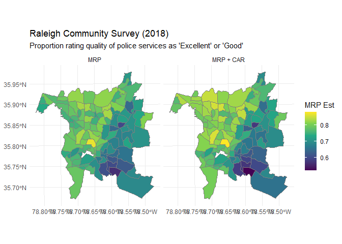
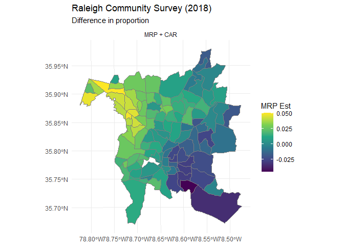

# MRP for Raleigh Community Survey 2018
Gio Circo
2023-06-20

## MRP Example Code

First, need to pull census data from ACS, link responses to census tract
level. NOTE: Can likely do even block group but not sure on how many
strata we can do. Will also have to rely somewhat on spatial weighting
as well (see ICAR models).

``` r
library(tidyverse)
library(brms)
library(tidycensus)
library(sf)
library(spdep)

# load survey data
svy <- read_csv("Ral18_Survey.csv")

# LOAD ACS DATA 
# ------------------------- #
vars <- filter(load_variables(2018, "acs5"), grepl("B01001", name))
demo_vars <- vars %>% select(name) %>% pull()

census <- get_acs(
  geography = "tract",
  state = "NC",
  county = "Wake",
  variables = demo_vars
) %>%
  left_join(vars, by = c("variable" = "name"))

# GEOGRAPHY
# ------------------------- #

# city limits of Raleigh
city_limits <- st_read("Raleigh_City_Council_Districts.shp") %>%
  st_transform(crs = 2264)

# Wake County tracts
raleigh_tract <-
  get_acs(
    geography = "tract",
    state = "NC",
    county = "Wake",
    variables = "B01001_001",
    geometry = TRUE
  ) %>%
  select(geoid = GEOID) %>%
  st_transform(crs = st_crs(city_limits))

# survey coords, spatial join to tract
svy_coords <- svy %>%
  select(ID, BLOCK_LAT, BLOCK_LON) %>%
  filter(!is.na(BLOCK_LAT)) %>%
  st_as_sf(coords = c('BLOCK_LON', 'BLOCK_LAT'), crs = 4326) %>%
  st_transform(crs = st_crs(city_limits)) %>%
  st_join(raleigh_tract) %>%
  tibble() %>%
  select(ID, geoid)

# create adjacency matrix
nb <- poly2nb(raleigh_tract)
W <- nb2mat(nb, style = "B")
row.names(W) <- raleigh_tract$geoid
```

## Data Setup

### Recode census data

``` r
# Select variables of interest, grouping up by relevant strata
# gender = 2, race = 4, age = 6
census_demos <- census %>%
  select(geoid = GEOID, estimate, label, concept) %>%
  group_by(geoid, concept) %>%
  slice(-1:-2) %>%
  mutate(
    sex = case_when(grepl("Female", label) ~ "female",
                       grepl("Male", label) ~ "male"),
    race = case_when(
      grepl("WHITE ALONE, NOT HISPANIC OR LATINO", concept) ~ "white",
      grepl("BLACK OR AFRICAN AMERICAN ALONE", concept) ~ "black",
      grepl("HISPANIC OR LATINO", concept) ~ "hispanic",
      grepl("NATIVE HAWAIIAN AND OTHER PACIFIC ISLANDER ALONE|ASIAN ALONE", concept) ~ "asian",
      grepl("TWO OR MORE RACES|SOME OTHER RACE ALONE", concept) ~ "other"
    ),
    age = case_when(
      grepl("18 and 19|20 to 24|25 to 29|30 to 34", label) ~ "18-34",
      grepl("35 to 44", label) ~ "35-44",
      grepl("45 to 54", label) ~ "45-54",
      grepl("55 to 64", label) ~ "55-64",
      grepl("65 to 74|75 to 84|85 years and over", label) ~ "65+"
    )
  ) %>%
  na.omit()

raleigh <-
  census_demos %>%
  group_by(geoid, sex, race, age) %>%
  summarise(count = sum(estimate)) %>%
  right_join(raleigh_tract) %>%
  st_as_sf()
```

### Recode survey data

``` r
# mrp svy
# this looks insane, but its just because the field names are wrong
# mrp svy
# this looks insane, but its just because the field names are wrong
mrp_svy <- svy %>%
  right_join(svy_coords) %>%
  rename(age = `Which_of_the_following_best_describes_your_race_or_ethnicity___28_01`,
         sex = `Household_Income__32`,
         pol_qual = `Quality_of_police_services__12_01`) %>%
  mutate(age = case_when(
    age == 1 ~ "18-34",
    age == 2 ~ "35-44",
    age == 3 ~ "45-54",
    age == 4 ~ "55-64",
    age == 5 ~ "65+"
  ),
  race = case_when(
    Ancestry__29 == 4 ~ "White",
    Which_of_the_following_is_the_highest_level_of_education_you_have_completed___31 == 1 ~ "Hispanic",
    !is.na(`Are_you_of_Spanish__Hispanic__or_Latino_Ancestry___29`) ~ "Black",
    !is.na(`Other__Answer__28_02`) ~ "Asian",
    TRUE ~ "Other"
  ),
  pol_qual = case_when(
    pol_qual %in% 4:5 ~ 1,
    pol_qual %in% 1:3 ~ 0
  )) %>%
  select(age,race,sex,geoid, pol_qual) %>% 
  na.omit()
```

    Joining, by = "ID"

### Strata to post-stratify to

``` r
# post strat table
post_strat <-
  mrp_svy %>%
  expand(age,race,sex,geoid)

head(post_strat)
```

    # A tibble: 6 × 4
      age   race  sex    geoid      
      <chr> <chr> <chr>  <chr>      
    1 18-34 Asian Female 37183050100
    2 18-34 Asian Female 37183050300
    3 18-34 Asian Female 37183050400
    4 18-34 Asian Female 37183050500
    5 18-34 Asian Female 37183050600
    6 18-34 Asian Female 37183050700

### Run MRP models

``` r
# MULTI-LEVEL REGRESSION
# ------------------------- #

# set tight priors for more regularization
bprior <- c(prior(normal(0, 2), class = "Intercept"),
            prior(normal(0, 2), class = "b"),
            prior(normal(0, 1), class = "sd"))

bprior2 <- c(prior(normal(0, 2), class = "Intercept"),
             prior(normal(0, 2), class = "b"),
             prior(normal(0, 1), class = "sdcar"),
             prior(normal(0, 1), class = "sd"))

# no spatial effects
fit1 <- brm(pol_qual ~ sex +
              (1|age) +
              (1|race) +
              (1|age:race) +
              (1|geoid),
            family = bernoulli(),
            prior = bprior,
            data = mrp_svy,
            chains = 4,
            cores = 4,
            iter = 2000,
            control = list(adapt_delta = .95))
```

    Compiling Stan program...

    Start sampling

``` r
summary(fit1)
```

     Family: bernoulli 
      Links: mu = logit 
    Formula: pol_qual ~ sex + (1 | age) + (1 | race) + (1 | age:race) + (1 | geoid) 
       Data: mrp_svy (Number of observations: 842) 
      Draws: 4 chains, each with iter = 2000; warmup = 1000; thin = 1;
             total post-warmup draws = 4000

    Group-Level Effects: 
    ~age (Number of levels: 5) 
                  Estimate Est.Error l-95% CI u-95% CI Rhat Bulk_ESS Tail_ESS
    sd(Intercept)     0.27      0.22     0.01     0.81 1.00     1573     1733

    ~age:race (Number of levels: 25) 
                  Estimate Est.Error l-95% CI u-95% CI Rhat Bulk_ESS Tail_ESS
    sd(Intercept)     0.22      0.16     0.01     0.60 1.01     1271     1695

    ~geoid (Number of levels: 107) 
                  Estimate Est.Error l-95% CI u-95% CI Rhat Bulk_ESS Tail_ESS
    sd(Intercept)     0.32      0.17     0.03     0.66 1.00     1068     1481

    ~race (Number of levels: 5) 
                  Estimate Est.Error l-95% CI u-95% CI Rhat Bulk_ESS Tail_ESS
    sd(Intercept)     0.69      0.32     0.27     1.49 1.00     1946     2069

    Population-Level Effects: 
              Estimate Est.Error l-95% CI u-95% CI Rhat Bulk_ESS Tail_ESS
    Intercept     0.87      0.40     0.06     1.63 1.00     2138     2767
    sexMale      -0.09      0.17    -0.43     0.25 1.00     6148     3196

    Draws were sampled using sampling(NUTS). For each parameter, Bulk_ESS
    and Tail_ESS are effective sample size measures, and Rhat is the potential
    scale reduction factor on split chains (at convergence, Rhat = 1).

``` r
# CAR model
# see: https://mc-stan.org/users/documentation/case-studies/icar_stan.html
# note: can't predict to regions with no observations
fit2 <- brm(pol_qual ~ sex +
              (1|age) +
              (1|race) +
              (1|age:race) +
              (1|geoid) +
              car(W, gr = geoid, type = 'bym'),
            family = bernoulli(),
            prior = bprior2,
            data = mrp_svy,
            data2 = list(W = W),
            chains = 4,
            cores = 4,
            iter = 2000,
            control = list(adapt_delta = .95))
```

    Compiling Stan program...
    Start sampling

``` r
summary(fit2)
```

     Family: bernoulli 
      Links: mu = logit 
    Formula: pol_qual ~ sex + (1 | age) + (1 | race) + (1 | age:race) + (1 | geoid) + car(W, gr = geoid, type = "bym") 
       Data: mrp_svy (Number of observations: 842) 
      Draws: 4 chains, each with iter = 2000; warmup = 1000; thin = 1;
             total post-warmup draws = 4000

    Correlation Structures:
           Estimate Est.Error l-95% CI u-95% CI Rhat Bulk_ESS Tail_ESS
    rhocar     0.61      0.26     0.08     0.98 1.00     1395     1824
    sdcar      0.36      0.16     0.05     0.67 1.00      997      758

    Group-Level Effects: 
    ~age (Number of levels: 5) 
                  Estimate Est.Error l-95% CI u-95% CI Rhat Bulk_ESS Tail_ESS
    sd(Intercept)     0.27      0.23     0.01     0.87 1.00     1351     1801

    ~age:race (Number of levels: 25) 
                  Estimate Est.Error l-95% CI u-95% CI Rhat Bulk_ESS Tail_ESS
    sd(Intercept)     0.22      0.16     0.01     0.58 1.00     1309     1675

    ~geoid (Number of levels: 107) 
                  Estimate Est.Error l-95% CI u-95% CI Rhat Bulk_ESS Tail_ESS
    sd(Intercept)     0.22      0.15     0.01     0.57 1.00      799     1801

    ~race (Number of levels: 5) 
                  Estimate Est.Error l-95% CI u-95% CI Rhat Bulk_ESS Tail_ESS
    sd(Intercept)     0.65      0.30     0.24     1.40 1.00     1974     2368

    Population-Level Effects: 
              Estimate Est.Error l-95% CI u-95% CI Rhat Bulk_ESS Tail_ESS
    Intercept     0.98      0.38     0.20     1.70 1.00     1734     2537
    sexMale      -0.09      0.17    -0.42     0.24 1.00     6194     2893

    Draws were sampled using sampling(NUTS). For each parameter, Bulk_ESS
    and Tail_ESS are effective sample size measures, and Rhat is the potential
    scale reduction factor on split chains (at convergence, Rhat = 1).

## Post Stratified Estimates

### MRP Estimates and MRP + CAR

``` r
# POST STRATIFICATION
# ------------------------- #

post_stratify <- function(model, post_strat_df, geo){
  
  # predictions
  pp <- posterior_predict(model, post_strat_df)
  pred_df <- tibble(post_strat_df, pred = apply(pp, 2, mean))
  
  # estimates
  est <-
    pred_df %>%
    mutate(across(where(is.character), tolower)) %>%
    left_join(geo) %>%
    na.omit() %>%
    mutate(pred = pred * count) %>%
    group_by(geoid) %>%
    summarise(count = sum(count),
              pred = sum(pred)) %>%
    mutate(prop = pred / count)
  
  return(est)
}

# get estimates for plain mrp and CAR model
ps_fit1 <- post_stratify(fit1, post_strat, raleigh) %>%
  mutate(model = "MRP")
```

    Joining, by = c("age", "race", "sex", "geoid")

``` r
ps_fit2 <- post_stratify(fit2, post_strat, raleigh) %>%
  mutate(model = "MRP + CAR")
```

    Joining, by = c("age", "race", "sex", "geoid")

``` r
plot_df <- rbind(ps_fit1, ps_fit2)

# Map of proportion
# note strong geographical differences (SW - NE)
plot_df %>%
  left_join(raleigh_tract) %>%
  st_as_sf() %>%
  ggplot() +
  geom_sf(aes(fill = prop), color = "grey50") +
  scale_fill_viridis_c() +
  scale_color_viridis_c() +
  theme_minimal() +
  facet_wrap(~ model) +
  labs(title = "Raleigh Community Survey (2018)",
       subtitle = "Proportion rating quality of police services as 'Excellent' or 'Good'",
       fill = "MRP Est")
```

    Joining, by = "geoid"



### Differences between MRP and MRP + CAR

A strong NE-SW gradient is apparent here. This is due to the spatial
weighting and likely accounts for some of the racial-based geographic
segregation. However the differences are *very* minor - on the order of
less than a percentage point.

``` r
# differences
plot_df %>%
  group_by(geoid) %>%
  mutate(diff = prop - lag(prop) ) %>%
  na.omit()%>%
  left_join(raleigh_tract) %>%
  st_as_sf() %>%
  ggplot() +
  geom_sf(aes(fill = diff), color = "grey50") +
  scale_fill_viridis_c() +
  theme_minimal() +
  facet_wrap(~ model) +
  labs(title = "Raleigh Community Survey (2018)",
       subtitle = "Difference in proportion",
       fill = "MRP Est")
```

    Joining, by = "geoid"


